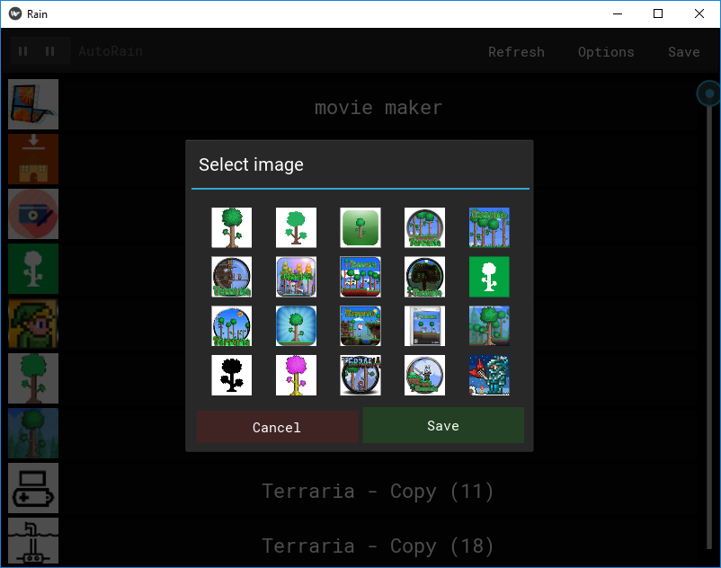

# Auto-Rain
A GUI to automate updating [Rainmeter](https://www.rainmeter.net/) .ini files and generating icons for executables. Currently only supports Dektos by Tibneo skin vertical right-side bar.

# Quick guide
A Windows executable can be found in the ./dist directory. Download the folder. Run `app.exe`.

You can also only download the `force_update.bat` file, put it in a folder, execute it. The needed files will be downloaded in your working directory.

## Configuring the application save paths

If you'd rather copy and paste your app, .ini, and image save paths, open rain.ini and edit the parameters. Otherwise, press "Change paths", click on the button next to the path you wish to edit - a file selection window will open. Find your desired file and click "Save".

